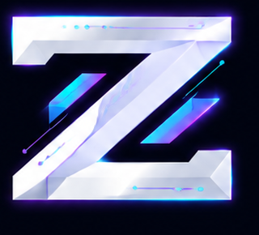

<div align="center">



# Zetta CRM — Landing

**Marketing site for Zetta CRM, the open-source MCP backend for AI agents.**

[](https://pages.cloudflare.com)
[](https://astro.build)

<sub>A partnership between <b>Incredible Zetta</b> and <a href="https://github.com/cds-id">Ciptadusa (CDS)</a></sub>

</div>

---

## Overview

This is the landing page for [Zetta CRM](https://github.com/incredible-zetta/crm) — a self-hosted Go MCP server that gives any AI agent a full CRM: contacts, email, campaigns, tracking, scheduling, and analytics.

The site communicates the product's value proposition to AI operators, vibecoders, and developers who use AI agents daily.

## Tech Stack

| Layer | Tool |
|-------|------|
| Framework | [Astro 5](https://astro.build) + React islands |
| Styling | [Tailwind CSS 4](https://tailwindcss.com) + [shadcn/ui](https://ui.shadcn.com) |
| Icons | [Lucide](https://lucide.dev) |
| Hosting | Cloudflare Pages |
| DNS | Ciptadusa (CDS) Cloudflare |

## Development

```bash
# Install
npm install

# Dev server
npm run dev

# Build (static output → dist/)
npm run build

# Preview production build
npm run preview
```

## Deployment

Deployed automatically via Cloudflare Pages on push to `main`.

| Setting | Value |
|---------|-------|
| Build command | `npm run build` |
| Output directory | `dist` |
| Node version | `22` |

## Project Structure

```
src/
├── components/     # Landing sections + ScrollMotion + ui/ (shadcn)
├── layouts/        # BaseLayout with SEO meta + JSON-LD + llms links
├── lib/            # Content (data.ts), GitHub meta, llms.txt generators
├── pages/          # index, install, llms.txt, llms-install.txt
└── styles/         # global.css (shadcn tokens + atmosphere/motion)
public/             # Logos, OG image, robots.txt
```

## Brand

- **Theme**: Default shadcn neutral (light default, dark toggle)
- **Typography**: Geist Variable
- **Motion**: GSAP ScrollTrigger (reveals, parallax, marquee, stacking)
- **UI**: Button, Badge, Card, Separator, Sheet, ThemeToggle

## Related

- [Zetta CRM Backend](https://github.com/incredible-zetta/crm) — Go MCP server (75 tools)
- [Ciptadusa](https://github.com/cds-id) — Partner organization
- [Install page](https://zettacrm.com/install) — SEO/GEO install guide with live tags
- [llms.txt](https://zettacrm.com/llms.txt) / [llms-install.txt](https://zettacrm.com/llms-install.txt)

## License

MIT
